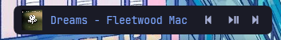

Depending on your screen size you may need to adjust the sizes of the componenets and the max text limit to get a similar look. Hopefully this explains everything, might not even make sense.


**This component is very buggy, as I'm not good with this stuff, so please only use it if you are fine with experiencing the bugs. The code is also a mess**

# Spotify Component 

The spotify component is a custom music component made to only display spotify music. It uses the Spotify API to fetch track information.



Updating the album art requires refreshing the bar using [Glaze IPC](https://github.com/glzr-io/glazewm-js/tree/main). This can lead to unwanted effects, such as the taskbar being enabled in fullscreen apps like games. This can be fixed by disabling the taskbar with a ahk script, stopping the script from running or pausing the music. However the AHK script will cause you to never see your taskbar again until you restart your system.

AHK Script:

``` AHK
WinHide, ahk_class Shell_TrayWnd
```

## Usage

### 1. Installation 

Navigate to the components directory inside the Glaze config directory and install the dependencies. 
```
cd components
npm install
```

### 2. Setup Spotify App

To use the Spotify API, you need to create a Spotify app. Follow these steps:

- Go to the [Spotify Developer Dashboard](https://developer.spotify.com/dashboard) and create a new app.
- Set the Redirect URI to http://localhost:3000/callback.
- Add your Client ID and Client Secret to [song_info.js](components/spotify/js/song_info.js).

### 3. Running the Script

```
node .\spotify\js\song_info.js
```
You will then be asked to login at http://localhost:3000/login. After which the component should work.